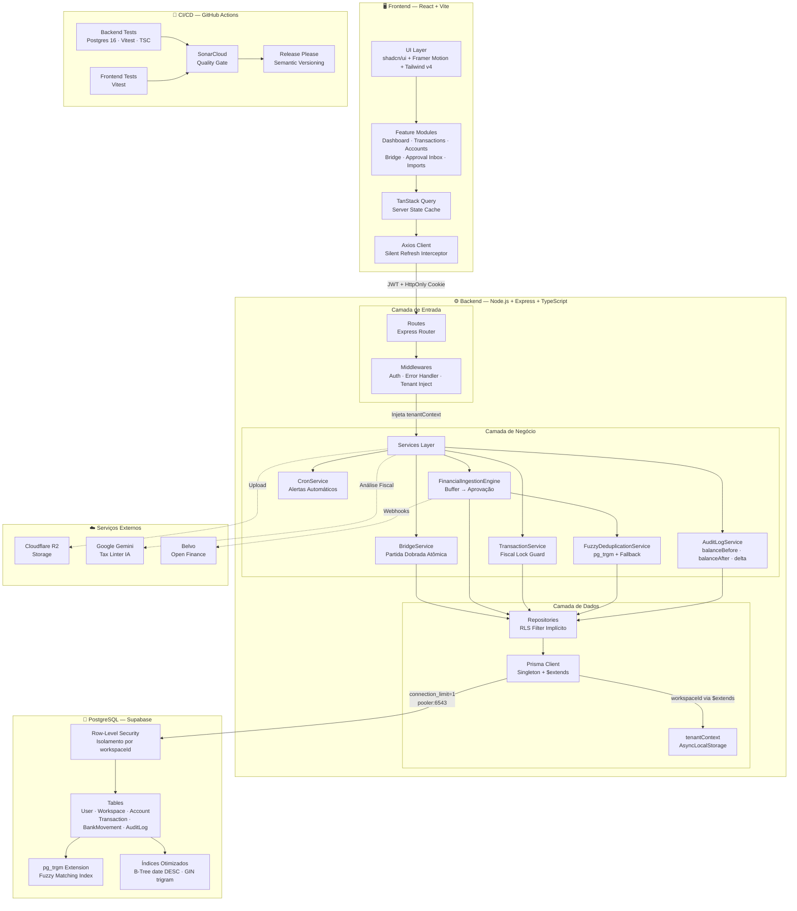
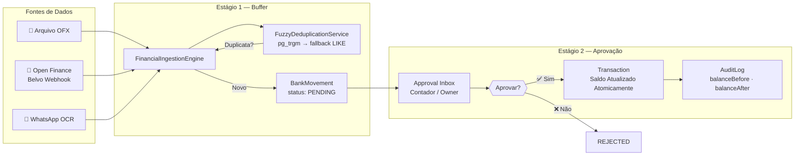
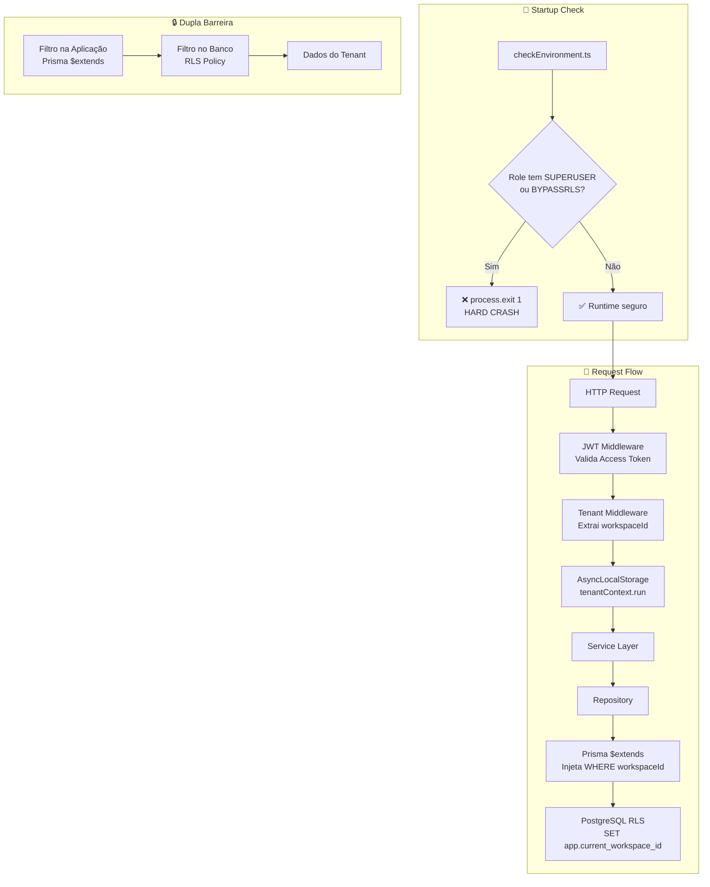
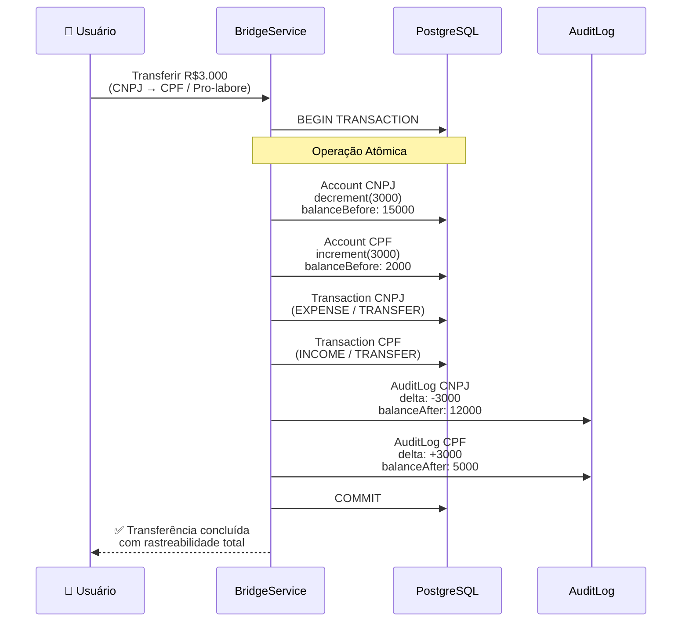

# 💰 WSP Finance


O **WSP Finance** é uma plataforma de gestão financeira híbrida (SaaS), projetada para atender o "Empreendedor Híbrido": aquele que precisa gerenciar suas finanças **Pessoais (CPF)** e **Empresariais (CNPJ)** em um único lugar, com isolamento total de dados e inteligência de mercado.

---

## 🚀 Stack Tecnológica

### Backend (API)
*   **Core:** Node.js, TypeScript, Express.
*   **Dados:** PostgreSQL, Prisma ORM (Decimal Precision).
*   **Segurança:** JWT (Dual Token), RBAC (Owner/Editor/Viewer), Cookies HttpOnly.
*   **Features:** Cron Jobs (Automação), OFX Parser, Uploads (Local/S3).

### Frontend (Web App)
*   **Core:** React (Vite), TypeScript.
*   **Estilo:** Tailwind CSS v4 (Glassmorphism Premium).
*   **Estado:** TanStack Query (Server State), Context API.
*   **Segurança:** Axios Interceptors (Silent Refresh), Memory-only Tokens.

---

## 🛠️ Guia de Instalação e Execução

Siga os passos abaixo para rodar o projeto completo localmente.

### Pré-requisitos
*   Node.js (v18+)
*   PNPM (Recomendado) ou NPM
*   PostgreSQL (Rodando localmente ou Docker)

### 1. Configurando o Backend

```bash
# 1. Entre na pasta do backend
cd backend

# 2. Instale as dependências
pnpm install

# 3. Configure as variáveis de ambiente
# Copie o arquivo de exemplo e edite as chaves (necessário para JWT Refresh e Storage, etc)
cp .env.example .env

# 4. Prepare o Banco de Dados
npx prisma generate                 # Gera a tipagem do Prisma
npx prisma migrate dev --name init  # Cria as tabelas
npx prisma db seed                  # Popula com dados de teste (Ana Silva)

# 5. Inicie o Servidor
pnpm dev
```
*O Backend rodará em: `http://localhost:3333`*

### 2. Configurando o Frontend

```bash
# 1. Abra um novo terminal e entre na pasta do frontend
cd frontend

# 2. Instale as dependências
pnpm install

# 3. Configure a variável de ambiente
# Copie o arquivo de exemplo caso exista ou crie para apontar a API
cp .env.example .env

# 4. Inicie a Aplicação
pnpm dev
```
*O Frontend rodará em: `http://localhost:5173`*

---

## 🧪 Credenciais de Teste (Seed)

O script de seed cria um cenário completo com transações, contas e dois workspaces.

*   **E-mail:** `ana@wspfinance.com`
*   **Senha:** `senha123`

---

## 🌟 Funcionalidades Principais

1.  **Multi-tenancy Híbrido:** Alterne entre "Pessoal" e "Empresa" com um clique. Dados e relatórios são totalmente isolados.
2.  **Bridge Service:** Transfira dinheiro entre workspaces (ex: Pro-labore) com rastreabilidade e auditoria.
3.  **Inteligência PACT:** Cálculo automático de margem líquida para vendas de Marketplace (Shopee/ML).
4.  **Automação:** Alertas diários de contas a pagar e risco de caixa (Saldo projetado negativo).
5.  **Importação OFX:** Importe extratos bancários com deduplicação inteligente.

---

## 🏗️ Arquitetura do Projeto

O WSP Finance adota uma **Layered Architecture com Service Pattern**, organizada em monorepo com separação física entre `backend/`, `frontend/` e `documentacao/`. O isolamento multi-tenant é garantido por **dupla barreira**: filtro na aplicação (Prisma `$extends`) e **Row-Level Security (RLS)** diretamente no PostgreSQL.

### Visão Geral

O diagrama abaixo mostra todas as camadas do sistema: o frontend React se comunica com a API Express via JWT, os services orquestram a lógica de negócio, os repositories aplicam o filtro de tenant implicitamente, e o PostgreSQL garante isolamento via RLS. Serviços externos (Cloudflare R2, Gemini, Belvo) são integrados de forma desacoplada, e o pipeline de CI/CD roda testes com banco real antes de qualquer merge.



---

### Fluxo de Ingestão Financeira (2 Estágios)

A ingestão financeira opera em dois estágios para garantir integridade. Dados de múltiplas fontes (OFX, Open Finance via Belvo, OCR via WhatsApp) entram pelo `FinancialIngestionEngine`, passam por deduplicação fuzzy via `pg_trgm` (com fallback automático para `LIKE/LOWER()` em caso de falha), e são persistidos como `BankMovement` com status `PENDING`. Nenhum saldo é alterado neste estágio. Somente após aprovação explícita no Approval Inbox é que o movimento é convertido em `Transaction`, o saldo é atualizado atomicamente, e o `AuditLog` registra `balanceBefore`, `balanceAfter` e `delta`.



---

### Segurança — Zero-Trust Multi-Tenant

O modelo de segurança opera com **princípio de menor privilégio** em todas as camadas. No startup, o sistema verifica se a role Postgres conectada possui `SUPERUSER` ou `BYPASSRLS` — se sim, a aplicação faz **hard crash** com `process.exit(1)`, impedindo qualquer operação com privilégios que neutralizem o RLS. Durante o request, o middleware de autenticação valida o JWT, extrai o `workspaceId` e o propaga via `AsyncLocalStorage` (`tenantContext`). O Prisma `$extends` injeta automaticamente o filtro `WHERE workspaceId = ?` em todas as queries, e o RLS do PostgreSQL aplica uma segunda barreira no nível do banco. Mesmo que a aplicação falhe em filtrar, o banco rejeita o acesso.



---

### Bridge Service — Partida Dobrada Atômica

O Bridge Service formaliza transferências entre workspaces (ex: pro-labore de CNPJ para CPF) usando partida dobrada contábil dentro de uma única transação de banco. O saldo é atualizado via `increment`/`decrement` atômico, duas transações são criadas (EXPENSE na origem, INCOME no destino), e o `AuditLog` registra `balanceBefore`, `balanceAfter` e `delta` para ambas as contas. Se qualquer etapa falhar, o `ROLLBACK` desfaz tudo — não existe estado intermediário.



---

## 📚 Documentação da API

Com o backend rodando, acesse o Swagger completo em:
👉 **http://localhost:3333/docs**


