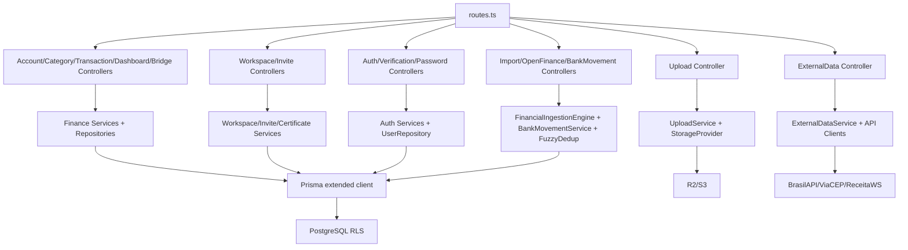
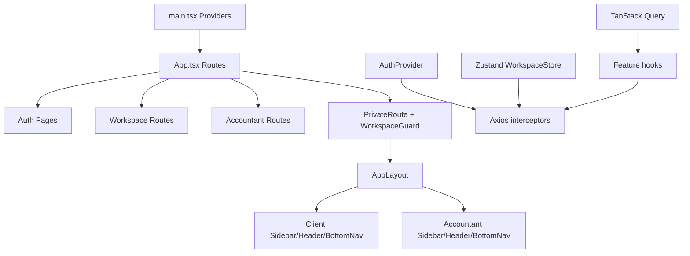

# C4 Components - Backend and Frontend

## Backend API

## Frontend SPA

## Observações

- 🟢 Controllers concentram validação Zod e HTTP.
- 🟢 Services concentram regras de negócio.
- 🟢 Repositories concentram Prisma.
- 🟡 Há uso de `sysPrisma` para operações globais/contador que precisam atravessar tenants com `set_config` manual.
