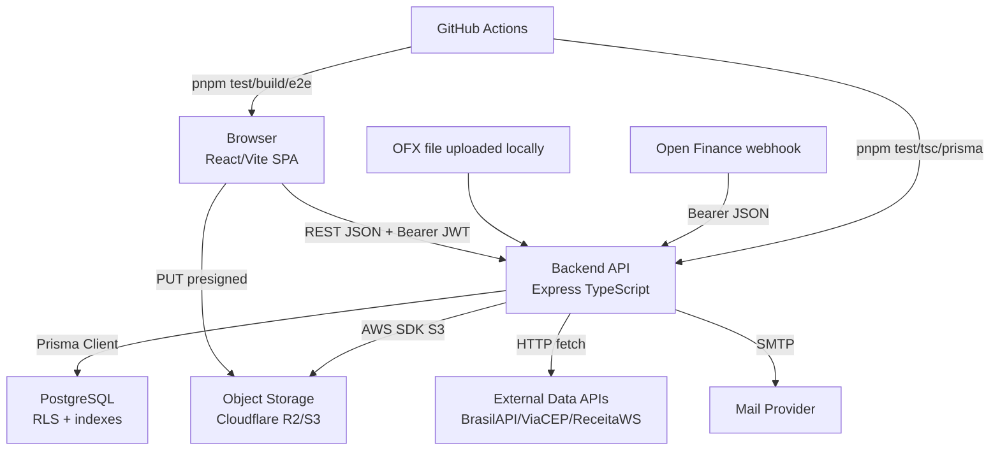

# C4 Containers - WSP Finance

## Containers

| Container | Deploy/Runtime | Observações |
|---|---|---|
| Browser SPA | Vite build estático | Rotas privadas, workspace guard, Axios interceptors. |
| Backend API | Node.js | Express, Swagger, cron, fail-fast RLS. |
| PostgreSQL | Supabase/Postgres inferido pelo código e docs | RLS, Prisma migrations, `DIRECT_URL`. |
| Object Storage | R2/S3 | SSE-C para vault. |
| CI | GitHub Actions Ubuntu | Backend tests, frontend tests, Playwright smoke, SonarCloud. |
