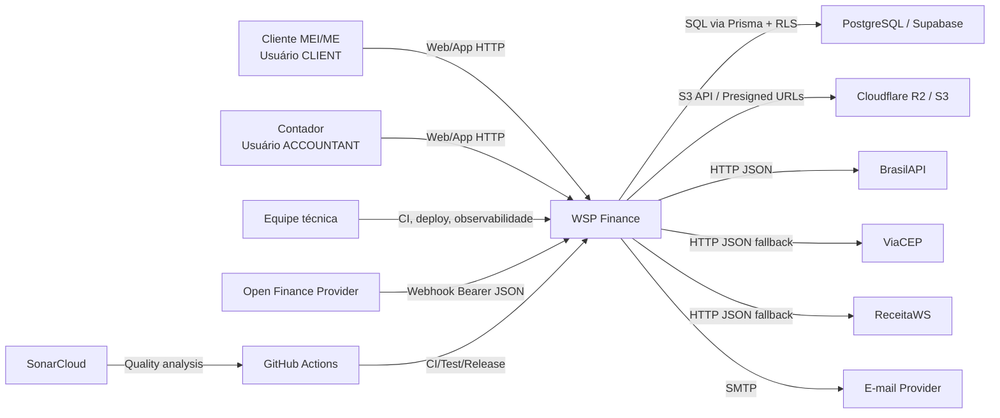

# C4 Context - WSP Finance

## Relações

| Origem | Destino | Relação | Confiança |
|---|---|---|---|
| Cliente | WSP Finance | gerencia workspace pessoal/empresa e transações. | 🟢 |
| Contador | WSP Finance | opera hub, inbox, convites e clientes. | 🟢 |
| WSP Finance | PostgreSQL | persiste domínio e aplica RLS. | 🟢 |
| WSP Finance | R2/S3 | armazena anexos e certificados. | 🟢 |
| WSP Finance | BrasilAPI/ViaCEP/ReceitaWS | busca dados externos. | 🟢 |
| Open Finance | WSP Finance | envia movimentos por webhook. | 🟢 |
