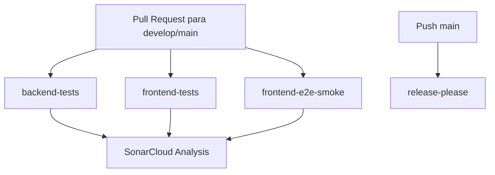

# Deployment and Operations

## Status

🟡 **INFERIDO/CONFIRMADO PARCIAL**: há CI/CD no GitHub Actions, scripts de build/test, configuração release-please e documentação mencionando Supabase/Render/SonarCloud. Não foi encontrado Dockerfile ou docker-compose no workspace analisado.

## Pipeline CI Confirmado

| Job | Ações | Confiança |
|---|---|---|
| Backend Tests + Coverage | Postgres 16 service, pnpm install, prisma generate, tsc, migrate deploy, seed, vitest coverage | 🟢 |
| Frontend Tests + Coverage | pnpm install, vitest coverage | 🟢 |
| Frontend Playwright Smoke | install Chromium, roda `cacheLogin.spec.ts` | 🟢 |
| SonarCloud Analysis | baixa coverage e roda scan | 🟢 |
| Release | release-please em push main | 🟢 |

## Runtime Esperado

| Peça | Configuração observada | Confiança |
|---|---|---|
| Backend | Node.js, `pnpm build`, `node dist/src/server.js` | 🟢 |
| Frontend | Vite build estático | 🟢 |
| Banco | PostgreSQL via Prisma `DATABASE_URL` e `DIRECT_URL` | 🟢 |
| Storage | R2/S3 via variáveis `R2_*` e `VAULT_MASTER_KEY` | 🟢 |
| Cron | `node-cron` dentro do backend | 🟢 |

## Lacunas Operacionais

- 🔴 Não há Dockerfile/docker-compose confirmado.
- 🔴 O CI usa `postgres` superuser para testes, enquanto runtime real deve reprovar superuser/bypass RLS.
- 🔴 Deploy de produção específico (Render/Vercel/etc.) não foi comprovado por arquivo de configuração nesta fase.
- 🟡 `PRODUCT_SCOPE_MASTER.md` menciona Supabase e Render, mas isso é documento de escopo, não configuração executável.
