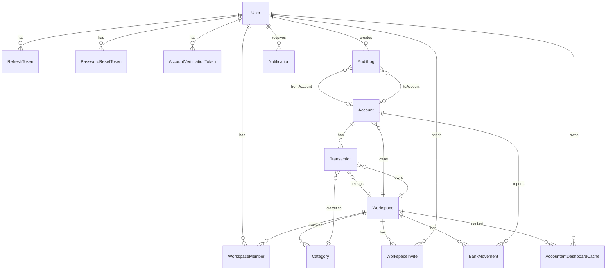

# ERD Complete - WSP Finance

## Entidades

| Entidade | Papel | Chaves/Índices relevantes |
|---|---|---|
| `User` | identidade global | `email unique`, `cpf unique` |
| `Workspace` | tenant/contexto | `type`, `closedUntil`, certificado |
| `WorkspaceMember` | RBAC por tenant | `@@unique([userId, workspaceId])` |
| `Account` | conta financeira | `workspaceId`, `balance Decimal(19,4)` |
| `Category` | categoria global ou tenant | `workspaceId` nullable |
| `Transaction` | lançamento real | `@@unique([workspaceId, fitid])`, `@@index([workspaceId,date])` |
| `AuditLog` | trilha de auditoria | `entity/entityId`, `workspaceId/createdAt` |
| `Notification` | alerta operacional | `userId` |
| `RefreshToken` | sessão | `userId` |
| `PasswordResetToken` | recuperação | `userId`, `used`, `expiresAt` |
| `AccountVerificationToken` | verificação e-mail | `userId`, `expiresAt` |
| `WorkspaceInvite` | convite | `token unique`, `email`, `workspaceId` |
| `BankMovement` | staging importado | unique por `fitid` e `hashDeduplication`, índices de fuzzy |
| `AccountantDashboardCache` | cache B2B contador | `@@unique([userId, workspaceId])` |
