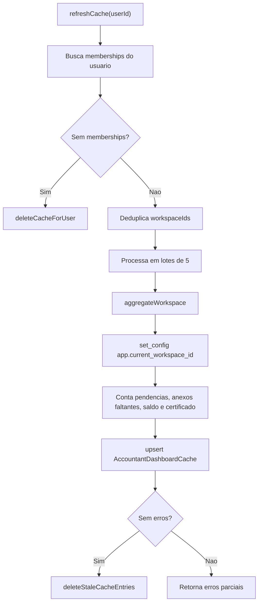

# Flowchart - accountant cache refresh

```mermaid
flowchart TD
  A["refreshCache(userId)"] --> B["Busca memberships do usuario"]
  B --> C{"Sem memberships?"}
  C -->|Sim| D["deleteCacheForUser"]
  C -->|Nao| E["Deduplica workspaceIds"]
  E --> F["Processa em lotes de 5"]
  F --> G["aggregateWorkspace"]
  G --> H["set_config app.current_workspace_id"]
  H --> I["Conta pendencias, anexos faltantes, saldo e certificado"]
  I --> J["upsert AccountantDashboardCache"]
  J --> K{"Sem erros?"}
  K -->|Sim| L["deleteStaleCacheEntries"]
  K -->|Nao| M["Retorna erros parciais"]
```
