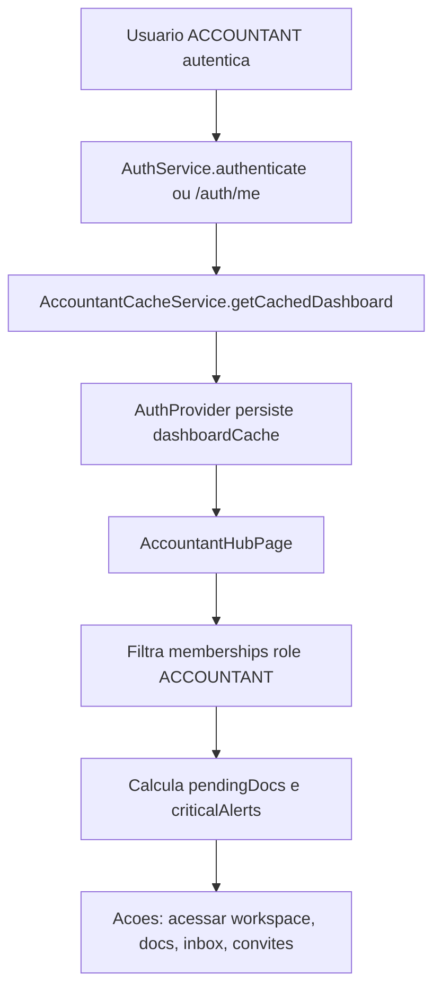

# Flowchart - accountant hub and cache

```mermaid
flowchart TD
  A["Usuario ACCOUNTANT autentica"] --> B["AuthService.authenticate ou /auth/me"]
  B --> C["AccountantCacheService.getCachedDashboard"]
  C --> D["AuthProvider persiste dashboardCache"]
  D --> E["AccountantHubPage"]
  E --> F["Filtra memberships role ACCOUNTANT"]
  F --> G["Calcula pendingDocs e criticalAlerts"]
  G --> H["Acoes: acessar workspace, docs, inbox, convites"]
```
