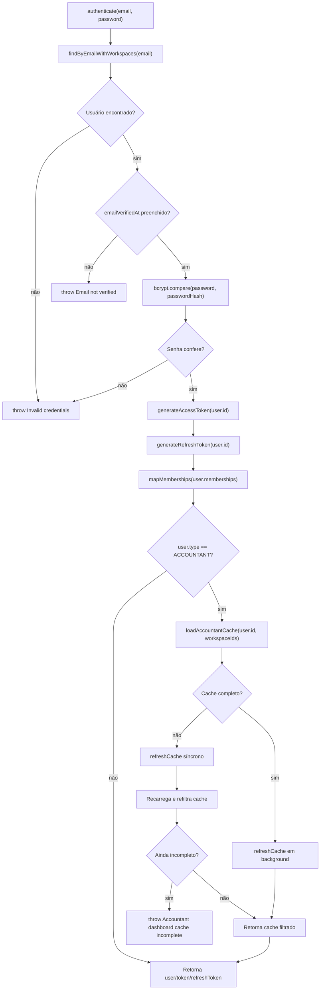

# Fluxograma - `AuthService.authenticate`

```mermaid
flowchart TD
  A["authenticate(email, password)"] --> B["findByEmailWithWorkspaces(email)"]
  B --> C{"Usuário encontrado?"}
  C -->|não| X["throw Invalid credentials"]
  C -->|sim| D{"emailVerifiedAt preenchido?"}
  D -->|não| Y["throw Email not verified"]
  D -->|sim| E["bcrypt.compare(password, passwordHash)"]
  E --> F{"Senha confere?"}
  F -->|não| X
  F -->|sim| G["generateAccessToken(user.id)"]
  G --> H["generateRefreshToken(user.id)"]
  H --> I["mapMemberships(user.memberships)"]
  I --> J{"user.type == ACCOUNTANT?"}
  J -->|não| K["Retorna user/token/refreshToken"]
  J -->|sim| L["loadAccountantCache(user.id, workspaceIds)"]
  L --> M{"Cache completo?"}
  M -->|não| N["refreshCache síncrono"]
  N --> O["Recarrega e refiltra cache"]
  O --> P{"Ainda incompleto?"}
  P -->|sim| Q["throw Accountant dashboard cache incomplete"]
  P -->|não| R["Retorna cache filtrado"]
  M -->|sim| S["refreshCache em background"]
  S --> R
  R --> K
```
