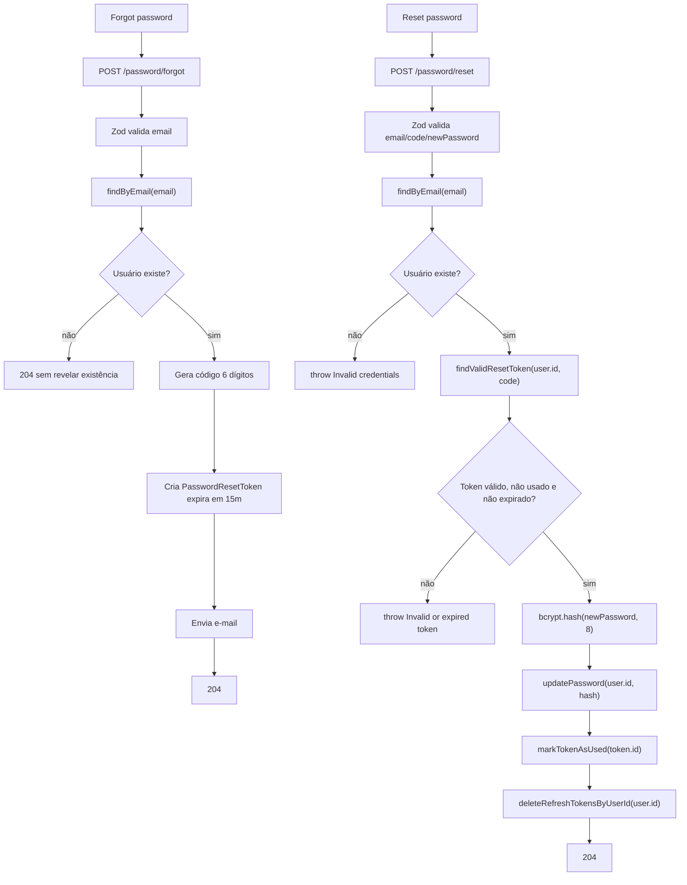

# Fluxograma - Recuperação de senha

```mermaid
flowchart TD
  A["Forgot password"] --> B["POST /password/forgot"]
  B --> C["Zod valida email"]
  C --> D["findByEmail(email)"]
  D --> E{"Usuário existe?"}
  E -->|não| F["204 sem revelar existência"]
  E -->|sim| G["Gera código 6 dígitos"]
  G --> H["Cria PasswordResetToken expira em 15m"]
  H --> I["Envia e-mail"]
  I --> J["204"]

  K["Reset password"] --> L["POST /password/reset"]
  L --> M["Zod valida email/code/newPassword"]
  M --> N["findByEmail(email)"]
  N --> O{"Usuário existe?"}
  O -->|não| P["throw Invalid credentials"]
  O -->|sim| Q["findValidResetToken(user.id, code)"]
  Q --> R{"Token válido, não usado e não expirado?"}
  R -->|não| S["throw Invalid or expired token"]
  R -->|sim| T["bcrypt.hash(newPassword, 8)"]
  T --> U["updatePassword(user.id, hash)"]
  U --> V["markTokenAsUsed(token.id)"]
  V --> W["deleteRefreshTokensByUserId(user.id)"]
  W --> X["204"]
```
