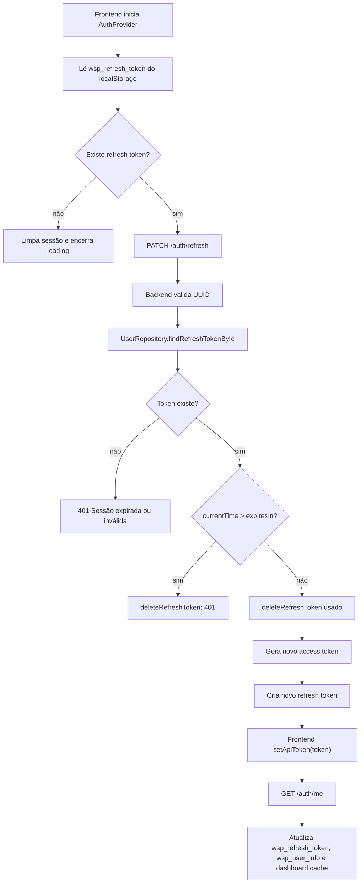

# Fluxograma - Refresh e restauração de sessão

```mermaid
flowchart TD
  A["Frontend inicia AuthProvider"] --> B["Lê wsp_refresh_token do localStorage"]
  B --> C{"Existe refresh token?"}
  C -->|não| D["Limpa sessão e encerra loading"]
  C -->|sim| E["PATCH /auth/refresh"]
  E --> F["Backend valida UUID"]
  F --> G["UserRepository.findRefreshTokenById"]
  G --> H{"Token existe?"}
  H -->|não| I["401 Sessão expirada ou inválida"]
  H -->|sim| J{"currentTime > expiresIn?"}
  J -->|sim| K["deleteRefreshToken; 401"]
  J -->|não| L["deleteRefreshToken usado"]
  L --> M["Gera novo access token"]
  M --> N["Cria novo refresh token"]
  N --> O["Frontend setApiToken(token)"]
  O --> P["GET /auth/me"]
  P --> Q["Atualiza wsp_refresh_token, wsp_user_info e dashboard cache"]
```
