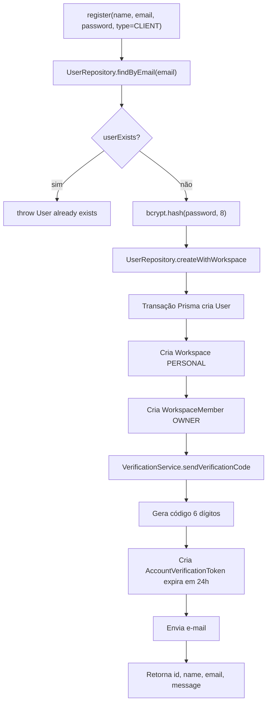

# Fluxograma - `AuthService.register`

```mermaid
flowchart TD
  A["register(name, email, password, type=CLIENT)"] --> B["UserRepository.findByEmail(email)"]
  B --> C{"userExists?"}
  C -->|sim| D["throw User already exists"]
  C -->|não| E["bcrypt.hash(password, 8)"]
  E --> F["UserRepository.createWithWorkspace"]
  F --> G["Transação Prisma cria User"]
  G --> H["Cria Workspace PERSONAL"]
  H --> I["Cria WorkspaceMember OWNER"]
  I --> J["VerificationService.sendVerificationCode"]
  J --> K["Gera código 6 dígitos"]
  K --> L["Cria AccountVerificationToken expira em 24h"]
  L --> M["Envia e-mail"]
  M --> N["Retorna id, name, email, message"]
```
