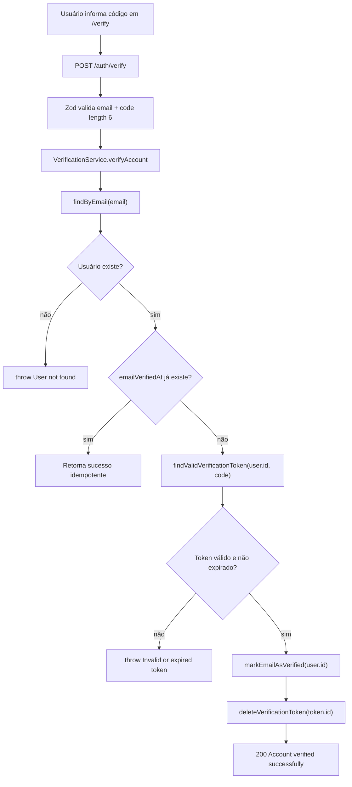

# Fluxograma - Verificação de e-mail

```mermaid
flowchart TD
  A["Usuário informa código em /verify"] --> B["POST /auth/verify"]
  B --> C["Zod valida email + code length 6"]
  C --> D["VerificationService.verifyAccount"]
  D --> E["findByEmail(email)"]
  E --> F{"Usuário existe?"}
  F -->|não| G["throw User not found"]
  F -->|sim| H{"emailVerifiedAt já existe?"}
  H -->|sim| I["Retorna sucesso idempotente"]
  H -->|não| J["findValidVerificationToken(user.id, code)"]
  J --> K{"Token válido e não expirado?"}
  K -->|não| L["throw Invalid or expired token"]
  K -->|sim| M["markEmailAsVerified(user.id)"]
  M --> N["deleteVerificationToken(token.id)"]
  N --> O["200 Account verified successfully"]
```
