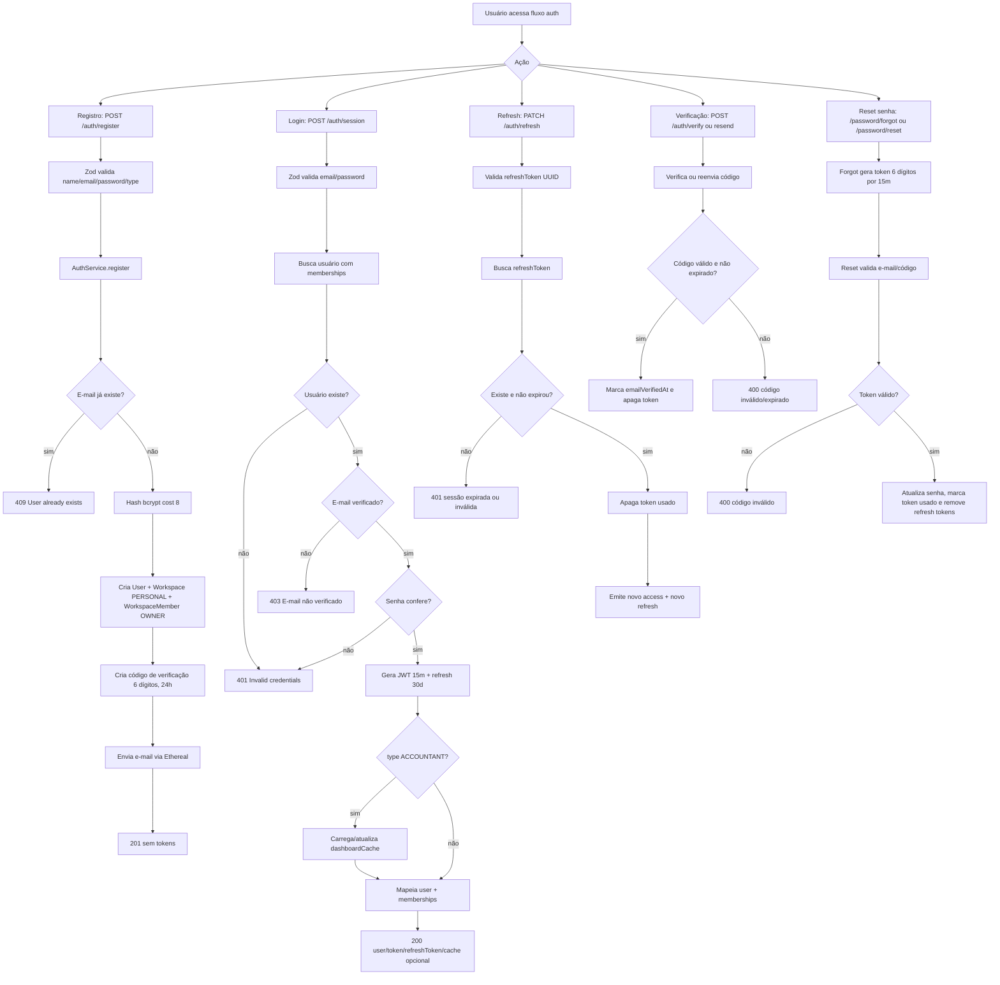

# Fluxograma - Módulo `auth`

```mermaid
flowchart TD
  A["Usuário acessa fluxo auth"] --> B{"Ação"}
  B --> C["Registro: POST /auth/register"]
  B --> D["Login: POST /auth/session"]
  B --> E["Refresh: PATCH /auth/refresh"]
  B --> F["Verificação: POST /auth/verify ou resend"]
  B --> G["Reset senha: /password/forgot ou /password/reset"]

  C --> C1["Zod valida name/email/password/type"]
  C1 --> C2["AuthService.register"]
  C2 --> C3{"E-mail já existe?"}
  C3 -->|sim| C4["409 User already exists"]
  C3 -->|não| C5["Hash bcrypt cost 8"]
  C5 --> C6["Cria User + Workspace PERSONAL + WorkspaceMember OWNER"]
  C6 --> C7["Cria código de verificação 6 dígitos, 24h"]
  C7 --> C8["Envia e-mail via Ethereal"]
  C8 --> C9["201 sem tokens"]

  D --> D1["Zod valida email/password"]
  D1 --> D2["Busca usuário com memberships"]
  D2 --> D3{"Usuário existe?"}
  D3 -->|não| D4["401 Invalid credentials"]
  D3 -->|sim| D5{"E-mail verificado?"}
  D5 -->|não| D6["403 E-mail não verificado"]
  D5 -->|sim| D7{"Senha confere?"}
  D7 -->|não| D4
  D7 -->|sim| D8["Gera JWT 15m + refresh 30d"]
  D8 --> D9{"type ACCOUNTANT?"}
  D9 -->|sim| D10["Carrega/atualiza dashboardCache"]
  D9 -->|não| D11["Mapeia user + memberships"]
  D10 --> D11
  D11 --> D12["200 user/token/refreshToken/cache opcional"]

  E --> E1["Valida refreshToken UUID"]
  E1 --> E2["Busca refreshToken"]
  E2 --> E3{"Existe e não expirou?"}
  E3 -->|não| E4["401 sessão expirada ou inválida"]
  E3 -->|sim| E5["Apaga token usado"]
  E5 --> E6["Emite novo access + novo refresh"]

  F --> F1["Verifica ou reenvia código"]
  F1 --> F2{"Código válido e não expirado?"}
  F2 -->|sim| F3["Marca emailVerifiedAt e apaga token"]
  F2 -->|não| F4["400 código inválido/expirado"]

  G --> G1["Forgot gera token 6 dígitos por 15m"]
  G1 --> G2["Reset valida e-mail/código"]
  G2 --> G3{"Token válido?"}
  G3 -->|não| G4["400 código inválido"]
  G3 -->|sim| G5["Atualiza senha, marca token usado e remove refresh tokens"]
```
