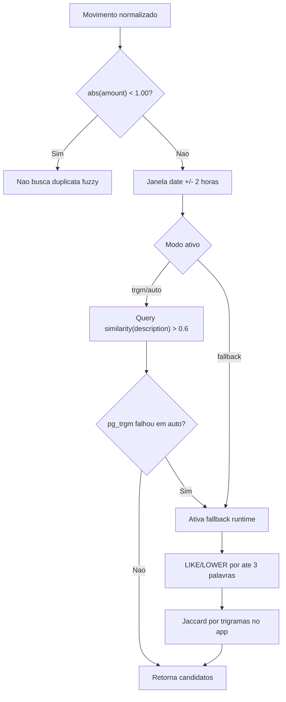

# Flowchart - fuzzy deduplication

```mermaid
flowchart TD
  A["Movimento normalizado"] --> B{"abs(amount) < 1.00?"}
  B -->|Sim| C["Nao busca duplicata fuzzy"]
  B -->|Nao| D["Janela date +/- 2 horas"]
  D --> E{"Modo ativo"}
  E -->|trgm/auto| F["Query similarity(description) > 0.6"]
  F --> G{"pg_trgm falhou em auto?"}
  G -->|Sim| H["Ativa fallback runtime"]
  G -->|Nao| I["Retorna candidatos"]
  E -->|fallback| H
  H --> J["LIKE/LOWER por ate 3 palavras"]
  J --> K["Jaccard por trigramas no app"]
  K --> I
```
