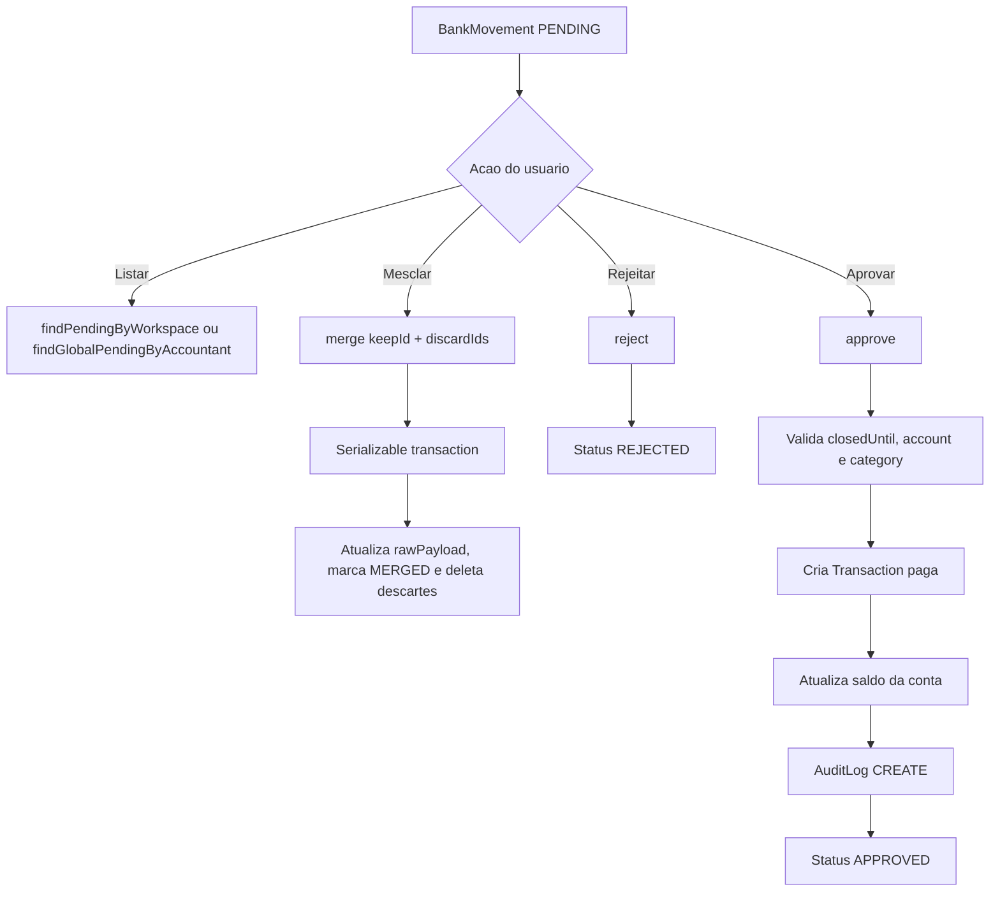

# Flowchart - bank-movements

```mermaid
flowchart TD
  A["BankMovement PENDING"] --> B{"Acao do usuario"}
  B -->|Listar| C["findPendingByWorkspace ou findGlobalPendingByAccountant"]
  B -->|Mesclar| D["merge keepId + discardIds"]
  D --> E["Serializable transaction"]
  E --> F["Atualiza rawPayload, marca MERGED e deleta descartes"]
  B -->|Rejeitar| G["reject"]
  G --> H["Status REJECTED"]
  B -->|Aprovar| I["approve"]
  I --> J["Valida closedUntil, account e category"]
  J --> K["Cria Transaction paga"]
  K --> L["Atualiza saldo da conta"]
  L --> M["AuditLog CREATE"]
  M --> N["Status APPROVED"]
```
