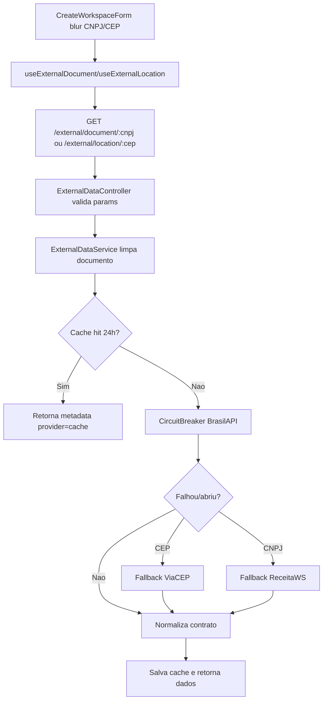

# Flowchart - external-data

```mermaid
flowchart TD
  A["CreateWorkspaceForm blur CNPJ/CEP"] --> B["useExternalDocument/useExternalLocation"]
  B --> C["GET /external/document/:cnpj ou /external/location/:cep"]
  C --> D["ExternalDataController valida params"]
  D --> E["ExternalDataService limpa documento"]
  E --> F{"Cache hit 24h?"}
  F -->|Sim| G["Retorna metadata provider=cache"]
  F -->|Nao| H["CircuitBreaker BrasilAPI"]
  H --> I{"Falhou/abriu?"}
  I -->|CEP| J["Fallback ViaCEP"]
  I -->|CNPJ| K["Fallback ReceitaWS"]
  I -->|Nao| L["Normaliza contrato"]
  J --> L
  K --> L
  L --> M["Salva cache e retorna dados"]
```
