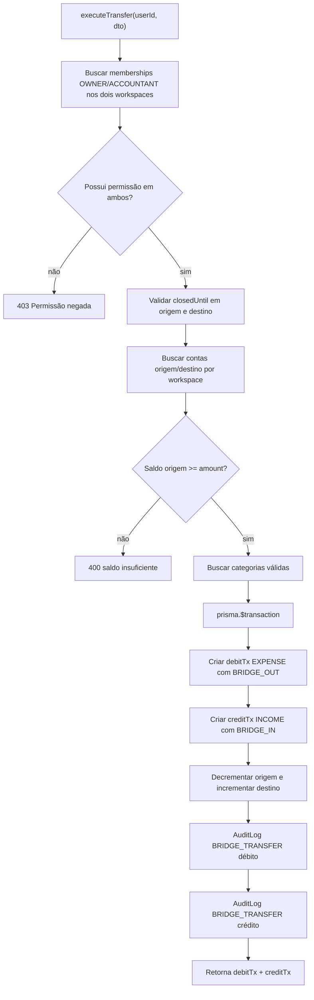

# Fluxograma - `BridgeService.executeTransfer`

```mermaid
flowchart TD
  A["executeTransfer(userId, dto)"] --> B["Buscar memberships OWNER/ACCOUNTANT nos dois workspaces"]
  B --> C{"Possui permissão em ambos?"}
  C -->|não| D["403 Permissão negada"]
  C -->|sim| E["Validar closedUntil em origem e destino"]
  E --> F["Buscar contas origem/destino por workspace"]
  F --> G{"Saldo origem >= amount?"}
  G -->|não| H["400 saldo insuficiente"]
  G -->|sim| I["Buscar categorias válidas"]
  I --> J["prisma.$transaction"]
  J --> K["Criar debitTx EXPENSE com BRIDGE_OUT"]
  K --> L["Criar creditTx INCOME com BRIDGE_IN"]
  L --> M["Decrementar origem e incrementar destino"]
  M --> N["AuditLog BRIDGE_TRANSFER débito"]
  N --> O["AuditLog BRIDGE_TRANSFER crédito"]
  O --> P["Retorna debitTx + creditTx"]
```
