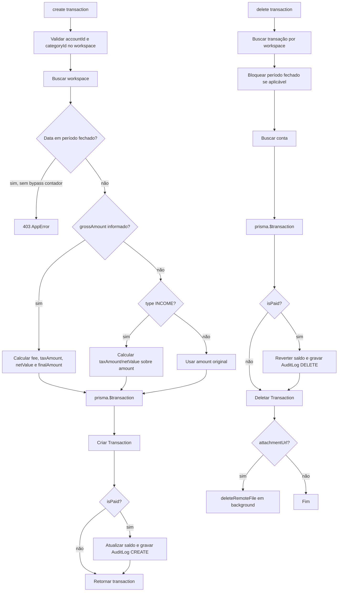

# Fluxograma - `TransactionService.create/delete`

```mermaid
flowchart TD
  A["create transaction"] --> B["Validar accountId e categoryId no workspace"]
  B --> C["Buscar workspace"]
  C --> D{"Data em período fechado?"}
  D -->|sim, sem bypass contador| E["403 AppError"]
  D -->|não| F{"grossAmount informado?"}
  F -->|sim| G["Calcular fee, taxAmount, netValue e finalAmount"]
  F -->|não| H{"type INCOME?"}
  H -->|sim| I["Calcular taxAmount/netValue sobre amount"]
  H -->|não| J["Usar amount original"]
  G --> K["prisma.$transaction"]
  I --> K
  J --> K
  K --> L["Criar Transaction"]
  L --> M{"isPaid?"}
  M -->|sim| N["Atualizar saldo e gravar AuditLog CREATE"]
  M -->|não| O["Retornar transaction"]
  N --> O

  P["delete transaction"] --> Q["Buscar transação por workspace"]
  Q --> R["Bloquear período fechado se aplicável"]
  R --> S["Buscar conta"]
  S --> T["prisma.$transaction"]
  T --> U{"isPaid?"}
  U -->|sim| V["Reverter saldo e gravar AuditLog DELETE"]
  U -->|não| W["Deletar Transaction"]
  V --> W
  W --> X{"attachmentUrl?"}
  X -->|sim| Y["deleteRemoteFile em background"]
  X -->|não| Z["Fim"]
```
