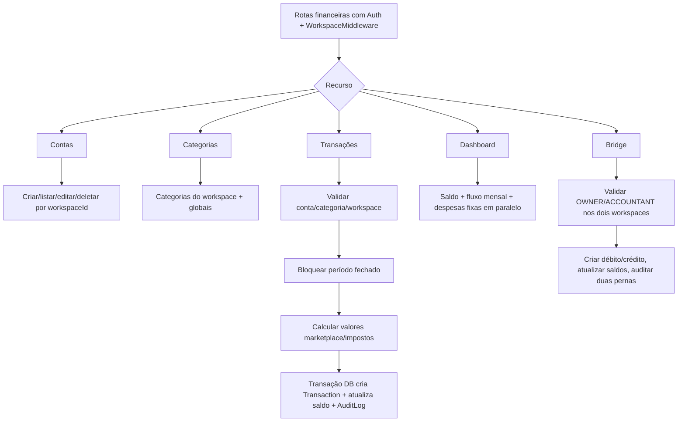

# Fluxograma - Módulo `finance-core`

```mermaid
flowchart TD
  A["Rotas financeiras com Auth + WorkspaceMiddleware"] --> B{"Recurso"}
  B --> C["Contas"]
  B --> D["Categorias"]
  B --> E["Transações"]
  B --> F["Dashboard"]
  B --> G["Bridge"]

  C --> C1["Criar/listar/editar/deletar por workspaceId"]
  D --> D1["Categorias do workspace + globais"]
  E --> E1["Validar conta/categoria/workspace"]
  E1 --> E2["Bloquear período fechado"]
  E2 --> E3["Calcular valores marketplace/impostos"]
  E3 --> E4["Transação DB cria Transaction + atualiza saldo + AuditLog"]
  F --> F1["Saldo + fluxo mensal + despesas fixas em paralelo"]
  G --> G1["Validar OWNER/ACCOUNTANT nos dois workspaces"]
  G1 --> G2["Criar débito/crédito, atualizar saldos, auditar duas pernas"]
```
