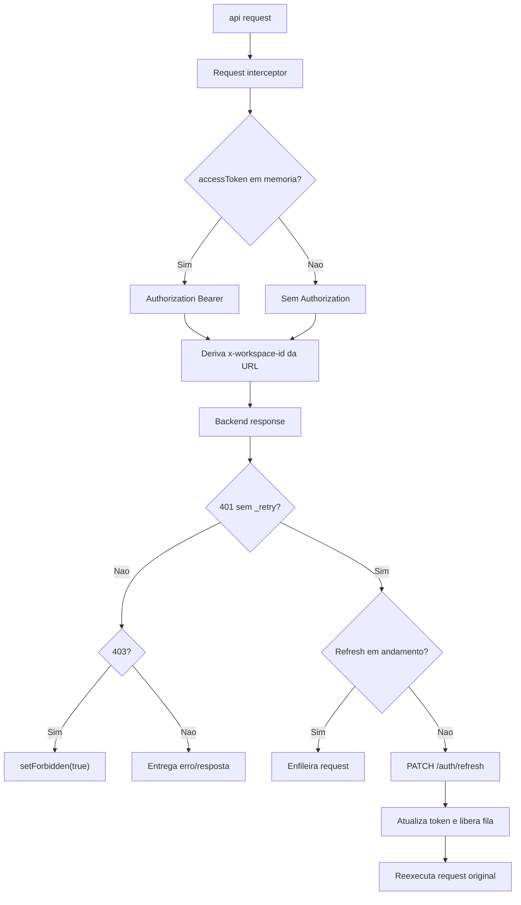

# Flowchart - axios session and workspace header

```mermaid
flowchart TD
  A["api request"] --> B["Request interceptor"]
  B --> C{"accessToken em memoria?"}
  C -->|Sim| D["Authorization Bearer"]
  C -->|Nao| E["Sem Authorization"]
  D --> F["Deriva x-workspace-id da URL"]
  E --> F
  F --> G["Backend response"]
  G --> H{"401 sem _retry?"}
  H -->|Nao| I{"403?"}
  I -->|Sim| J["setForbidden(true)"]
  I -->|Nao| K["Entrega erro/resposta"]
  H -->|Sim| L{"Refresh em andamento?"}
  L -->|Sim| M["Enfileira request"]
  L -->|Nao| N["PATCH /auth/refresh"]
  N --> O["Atualiza token e libera fila"]
  O --> P["Reexecuta request original"]
```
