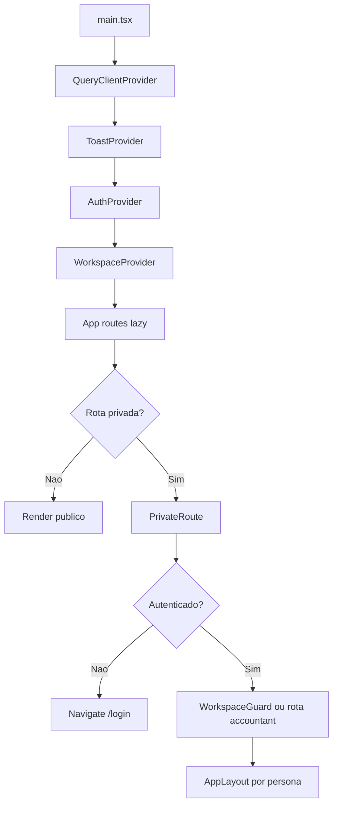

# Flowchart - frontend-shell

```mermaid
flowchart TD
  A["main.tsx"] --> B["QueryClientProvider"]
  B --> C["ToastProvider"]
  C --> D["AuthProvider"]
  D --> E["WorkspaceProvider"]
  E --> F["App routes lazy"]
  F --> G{"Rota privada?"}
  G -->|Nao| H["Render publico"]
  G -->|Sim| I["PrivateRoute"]
  I --> J{"Autenticado?"}
  J -->|Nao| K["Navigate /login"]
  J -->|Sim| L["WorkspaceGuard ou rota accountant"]
  L --> M["AppLayout por persona"]
```
