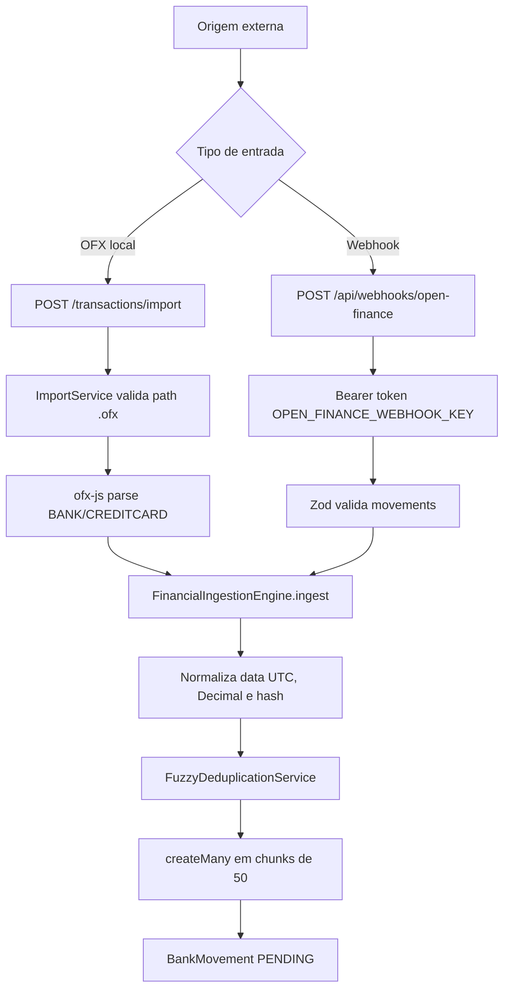

# Flowchart - imports-open-finance

```mermaid
flowchart TD
  A["Origem externa"] --> B{"Tipo de entrada"}
  B -->|OFX local| C["POST /transactions/import"]
  C --> D["ImportService valida path .ofx"]
  D --> E["ofx-js parse BANK/CREDITCARD"]
  B -->|Webhook| F["POST /api/webhooks/open-finance"]
  F --> G["Bearer token OPEN_FINANCE_WEBHOOK_KEY"]
  G --> H["Zod valida movements"]
  E --> I["FinancialIngestionEngine.ingest"]
  H --> I
  I --> J["Normaliza data UTC, Decimal e hash"]
  J --> K["FuzzyDeduplicationService"]
  K --> L["createMany em chunks de 50"]
  L --> M["BankMovement PENDING"]
```
