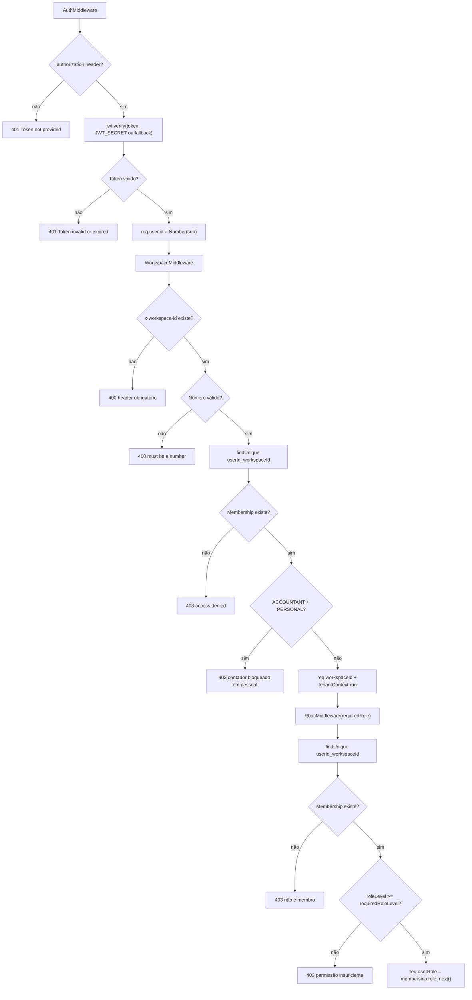

# Fluxograma - Middleware auth/workspace/RBAC

```mermaid
flowchart TD
  A["AuthMiddleware"] --> B{"authorization header?"}
  B -->|não| C["401 Token not provided"]
  B -->|sim| D["jwt.verify(token, JWT_SECRET ou fallback)"]
  D --> E{"Token válido?"}
  E -->|não| F["401 Token invalid or expired"]
  E -->|sim| G["req.user.id = Number(sub)"]

  G --> H["WorkspaceMiddleware"]
  H --> I{"x-workspace-id existe?"}
  I -->|não| J["400 header obrigatório"]
  I -->|sim| K{"Número válido?"}
  K -->|não| L["400 must be a number"]
  K -->|sim| M["findUnique userId_workspaceId"]
  M --> N{"Membership existe?"}
  N -->|não| O["403 access denied"]
  N -->|sim| P{"ACCOUNTANT + PERSONAL?"}
  P -->|sim| Q["403 contador bloqueado em pessoal"]
  P -->|não| R["req.workspaceId + tenantContext.run"]

  R --> S["RbacMiddleware(requiredRole)"]
  S --> T["findUnique userId_workspaceId"]
  T --> U{"Membership existe?"}
  U -->|não| V["403 não é membro"]
  U -->|sim| W{"roleLevel >= requiredRoleLevel?"}
  W -->|não| X["403 permissão insuficiente"]
  W -->|sim| Y["req.userRole = membership.role; next()"]
```
