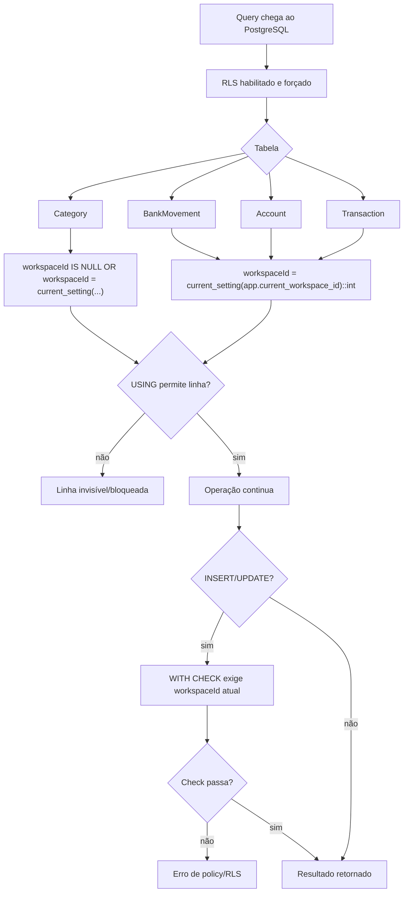

# Fluxograma - Policy PostgreSQL RLS

```mermaid
flowchart TD
  A["Query chega ao PostgreSQL"] --> B["RLS habilitado e forçado"]
  B --> C{"Tabela"}
  C --> D["Transaction"]
  C --> E["Account"]
  C --> F["Category"]
  C --> G["BankMovement"]
  D --> H["workspaceId = current_setting(app.current_workspace_id)::int"]
  E --> H
  G --> H
  F --> I["workspaceId IS NULL OR workspaceId = current_setting(...)"]
  H --> J{"USING permite linha?"}
  I --> J
  J -->|não| K["Linha invisível/bloqueada"]
  J -->|sim| L["Operação continua"]
  L --> M{"INSERT/UPDATE?"}
  M -->|sim| N["WITH CHECK exige workspaceId atual"]
  M -->|não| O["Resultado retornado"]
  N --> P{"Check passa?"}
  P -->|não| Q["Erro de policy/RLS"]
  P -->|sim| O
```
