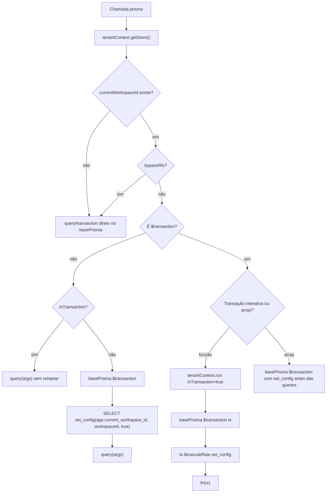

# Fluxograma - Prisma RLS extension

```mermaid
flowchart TD
  A["Chamada prisma"] --> B["tenantContext.getStore()"]
  B --> C{"currentWorkspaceId existe?"}
  C -->|não| D["query/transaction direto no basePrisma"]
  C -->|sim| E{"bypassRls?"}
  E -->|sim| D
  E -->|não| F{"É $transaction?"}
  F -->|não| G{"inTransaction?"}
  G -->|sim| H["query(args) sem reinjetar"]
  G -->|não| I["basePrisma.$transaction"]
  I --> J["SELECT set_config(app.current_workspace_id, workspaceId, true)"]
  J --> K["query(args)"]
  F -->|sim| L{"Transação interativa ou array?"}
  L -->|"função"| M["tenantContext.run inTransaction=true"]
  M --> N["basePrisma.$transaction tx"]
  N --> O["tx.$executeRaw set_config"]
  O --> P["fn(tx)"]
  L -->|"array"| Q["basePrisma.$transaction com set_config antes das queries"]
```
