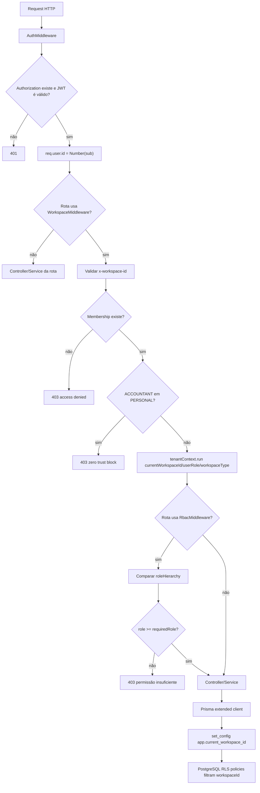

# Fluxograma - Módulo `rbac-rls`

```mermaid
flowchart TD
  A["Request HTTP"] --> B["AuthMiddleware"]
  B --> C{"Authorization existe e JWT é válido?"}
  C -->|não| D["401"]
  C -->|sim| E["req.user.id = Number(sub)"]
  E --> F{"Rota usa WorkspaceMiddleware?"}
  F -->|não| G["Controller/Service da rota"]
  F -->|sim| H["Validar x-workspace-id"]
  H --> I{"Membership existe?"}
  I -->|não| J["403 access denied"]
  I -->|sim| K{"ACCOUNTANT em PERSONAL?"}
  K -->|sim| L["403 zero trust block"]
  K -->|não| M["tenantContext.run currentWorkspaceId/userRole/workspaceType"]
  M --> N{"Rota usa RbacMiddleware?"}
  N -->|sim| O["Comparar roleHierarchy"]
  O --> P{"role >= requiredRole?"}
  P -->|não| Q["403 permissão insuficiente"]
  P -->|sim| R["Controller/Service"]
  N -->|não| R
  R --> S["Prisma extended client"]
  S --> T["set_config app.current_workspace_id"]
  T --> U["PostgreSQL RLS policies filtram workspaceId"]
```
