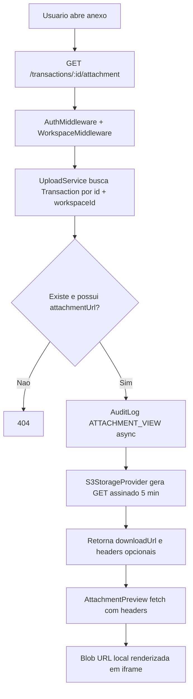

# Flowchart - attachment signed view

```mermaid
flowchart TD
  A["Usuario abre anexo"] --> B["GET /transactions/:id/attachment"]
  B --> C["AuthMiddleware + WorkspaceMiddleware"]
  C --> D["UploadService busca Transaction por id + workspaceId"]
  D --> E{"Existe e possui attachmentUrl?"}
  E -->|Nao| F["404"]
  E -->|Sim| G["AuditLog ATTACHMENT_VIEW async"]
  G --> H["S3StorageProvider gera GET assinado 5 min"]
  H --> I["Retorna downloadUrl e headers opcionais"]
  I --> J["AttachmentPreview fetch com headers"]
  J --> K["Blob URL local renderizada em iframe"]
```
