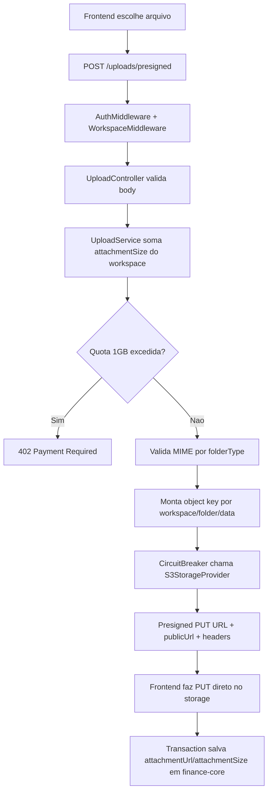

# Flowchart - uploads-storage

```mermaid
flowchart TD
  A["Frontend escolhe arquivo"] --> B["POST /uploads/presigned"]
  B --> C["AuthMiddleware + WorkspaceMiddleware"]
  C --> D["UploadController valida body"]
  D --> E["UploadService soma attachmentSize do workspace"]
  E --> F{"Quota 1GB excedida?"}
  F -->|Sim| G["402 Payment Required"]
  F -->|Nao| H["Valida MIME por folderType"]
  H --> I["Monta object key por workspace/folder/data"]
  I --> J["CircuitBreaker chama S3StorageProvider"]
  J --> K["Presigned PUT URL + publicUrl + headers"]
  K --> L["Frontend faz PUT direto no storage"]
  L --> M["Transaction salva attachmentUrl/attachmentSize em finance-core"]
```
