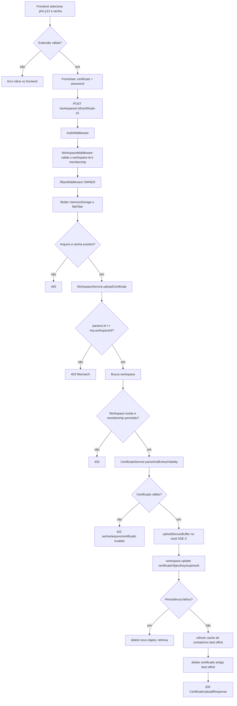

# Fluxograma - Upload de certificado A1

```mermaid
flowchart TD
  A["Frontend seleciona .pfx/.p12 e senha"] --> B{"Extensão válida?"}
  B -->|não| C["Erro inline no frontend"]
  B -->|sim| D["FormData: certificate + password"]
  D --> E["POST /workspaces/:id/certificate-a1"]
  E --> F["AuthMiddleware"]
  F --> G["WorkspaceMiddleware valida x-workspace-id e membership"]
  G --> H["RbacMiddleware OWNER"]
  H --> I["Multer memoryStorage e fileFilter"]
  I --> J{"Arquivo e senha existem?"}
  J -->|não| K["400"]
  J -->|sim| L["WorkspaceService.uploadCertificate"]
  L --> M{"params.id == req.workspaceId?"}
  M -->|não| N["403 Mismatch"]
  M -->|sim| O["Busca workspace"]
  O --> P{"Workspace existe e membership permitido?"}
  P -->|não| Q["403"]
  P -->|sim| R["CertificateService.parseAndExtractValidity"]
  R --> S{"Certificado válido?"}
  S -->|não| T["422 senha/arquivo/certificado inválido"]
  S -->|sim| U["uploadSecureBuffer no vault SSE-C"]
  U --> V["workspace.update certificateObjectKey/expiresAt"]
  V --> W{"Persistência falhou?"}
  W -->|sim| X["delete novo objeto; rethrow"]
  W -->|não| Y["refresh cache de contadores best effort"]
  Y --> Z["delete certificado antigo best effort"]
  Z --> AA["200 CertificateUploadResponse"]
```
