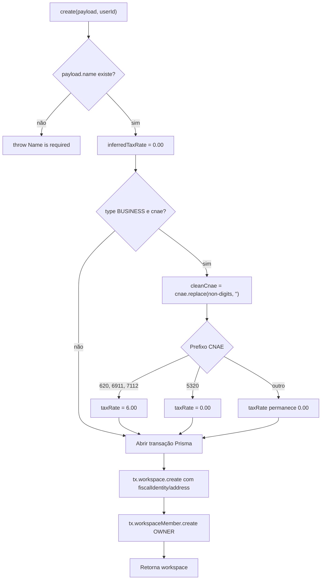

# Fluxograma - `WorkspaceService.create`

```mermaid
flowchart TD
  A["create(payload, userId)"] --> B{"payload.name existe?"}
  B -->|não| C["throw Name is required"]
  B -->|sim| D["inferredTaxRate = 0.00"]
  D --> E{"type BUSINESS e cnae?"}
  E -->|não| H["Abrir transação Prisma"]
  E -->|sim| F["cleanCnae = cnae.replace(non-digits, '')"]
  F --> G{"Prefixo CNAE"}
  G -->|"620, 6911, 7112"| G1["taxRate = 6.00"]
  G -->|"5320"| G2["taxRate = 0.00"]
  G -->|"outro"| G3["taxRate permanece 0.00"]
  G1 --> H
  G2 --> H
  G3 --> H
  H --> I["tx.workspace.create com fiscalIdentity/address"]
  I --> J["tx.workspaceMember.create OWNER"]
  J --> K["Retorna workspace"]
```
