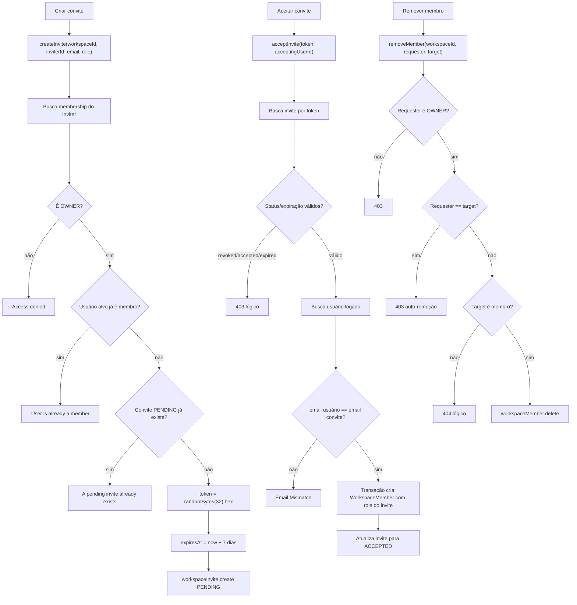

# Fluxograma - Convites e membros

```mermaid
flowchart TD
  A["Criar convite"] --> B["createInvite(workspaceId, inviterId, email, role)"]
  B --> C["Busca membership do inviter"]
  C --> D{"É OWNER?"}
  D -->|não| E["Access denied"]
  D -->|sim| F{"Usuário alvo já é membro?"}
  F -->|sim| G["User is already a member"]
  F -->|não| H{"Convite PENDING já existe?"}
  H -->|sim| I["A pending invite already exists"]
  H -->|não| J["token = randomBytes(32).hex"]
  J --> K["expiresAt = now + 7 dias"]
  K --> L["workspaceInvite.create PENDING"]

  M["Aceitar convite"] --> N["acceptInvite(token, acceptingUserId)"]
  N --> O["Busca invite por token"]
  O --> P{"Status/expiração válidos?"}
  P -->|revoked/accepted/expired| Q["403 lógico"]
  P -->|válido| R["Busca usuário logado"]
  R --> S{"email usuário == email convite?"}
  S -->|não| T["Email Mismatch"]
  S -->|sim| U["Transação cria WorkspaceMember com role do invite"]
  U --> V["Atualiza invite para ACCEPTED"]

  W["Remover membro"] --> X["removeMember(workspaceId, requester, target)"]
  X --> Y{"Requester é OWNER?"}
  Y -->|não| Z["403"]
  Y -->|sim| AA{"Requester == target?"}
  AA -->|sim| AB["403 auto-remoção"]
  AA -->|não| AC{"Target é membro?"}
  AC -->|não| AD["404 lógico"]
  AC -->|sim| AE["workspaceMember.delete"]
```
