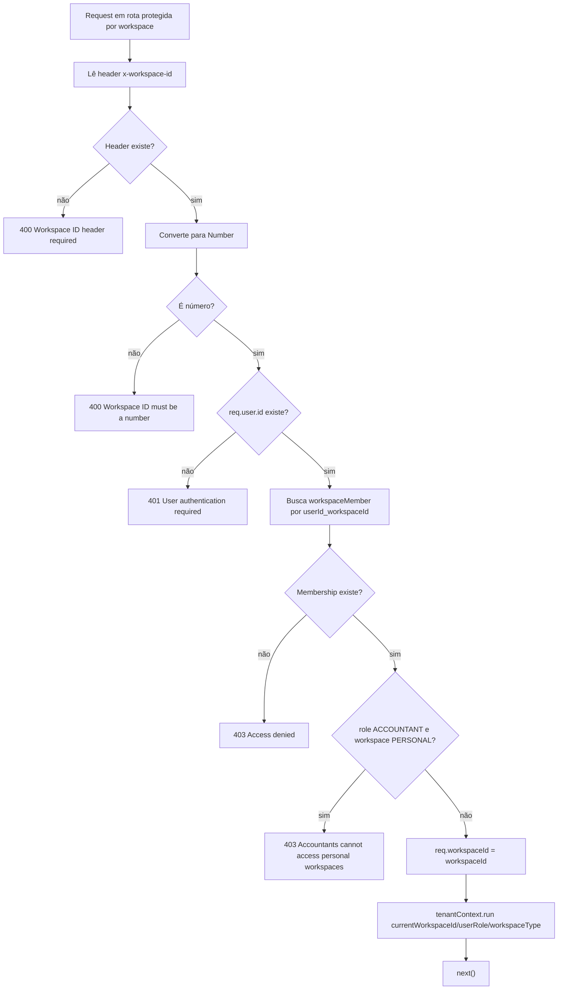

# Fluxograma - `WorkspaceMiddleware`

```mermaid
flowchart TD
  A["Request em rota protegida por workspace"] --> B["Lê header x-workspace-id"]
  B --> C{"Header existe?"}
  C -->|não| D["400 Workspace ID header required"]
  C -->|sim| E["Converte para Number"]
  E --> F{"É número?"}
  F -->|não| G["400 Workspace ID must be a number"]
  F -->|sim| H{"req.user.id existe?"}
  H -->|não| I["401 User authentication required"]
  H -->|sim| J["Busca workspaceMember por userId_workspaceId"]
  J --> K{"Membership existe?"}
  K -->|não| L["403 Access denied"]
  K -->|sim| M{"role ACCOUNTANT e workspace PERSONAL?"}
  M -->|sim| N["403 Accountants cannot access personal workspaces"]
  M -->|não| O["req.workspaceId = workspaceId"]
  O --> P["tenantContext.run currentWorkspaceId/userRole/workspaceType"]
  P --> Q["next()"]
```
