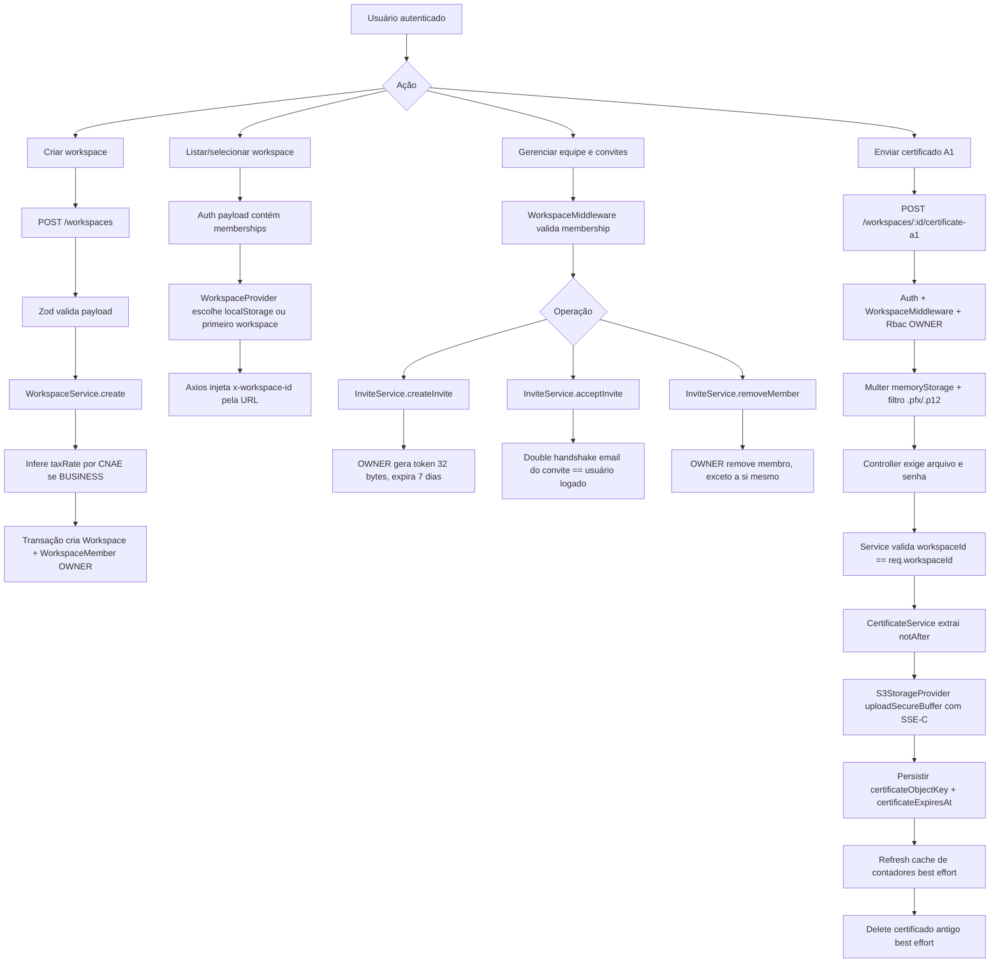

# Fluxograma - Módulo `workspaces`

```mermaid
flowchart TD
  A["Usuário autenticado"] --> B{"Ação"}
  B --> C["Criar workspace"]
  B --> D["Listar/selecionar workspace"]
  B --> E["Gerenciar equipe e convites"]
  B --> F["Enviar certificado A1"]

  C --> C1["POST /workspaces"]
  C1 --> C2["Zod valida payload"]
  C2 --> C3["WorkspaceService.create"]
  C3 --> C4["Infere taxRate por CNAE se BUSINESS"]
  C4 --> C5["Transação cria Workspace + WorkspaceMember OWNER"]

  D --> D1["Auth payload contém memberships"]
  D1 --> D2["WorkspaceProvider escolhe localStorage ou primeiro workspace"]
  D2 --> D3["Axios injeta x-workspace-id pela URL"]

  E --> E1["WorkspaceMiddleware valida membership"]
  E1 --> E2{"Operação"}
  E2 --> E3["InviteService.createInvite"]
  E2 --> E4["InviteService.acceptInvite"]
  E2 --> E5["InviteService.removeMember"]
  E3 --> E6["OWNER gera token 32 bytes, expira 7 dias"]
  E4 --> E7["Double handshake email do convite == usuário logado"]
  E5 --> E8["OWNER remove membro, exceto a si mesmo"]

  F --> F1["POST /workspaces/:id/certificate-a1"]
  F1 --> F2["Auth + WorkspaceMiddleware + Rbac OWNER"]
  F2 --> F3["Multer memoryStorage + filtro .pfx/.p12"]
  F3 --> F4["Controller exige arquivo e senha"]
  F4 --> F5["Service valida workspaceId == req.workspaceId"]
  F5 --> F6["CertificateService extrai notAfter"]
  F6 --> F7["S3StorageProvider uploadSecureBuffer com SSE-C"]
  F7 --> F8["Persistir certificateObjectKey + certificateExpiresAt"]
  F8 --> F9["Refresh cache de contadores best effort"]
  F9 --> F10["Delete certificado antigo best effort"]
```
