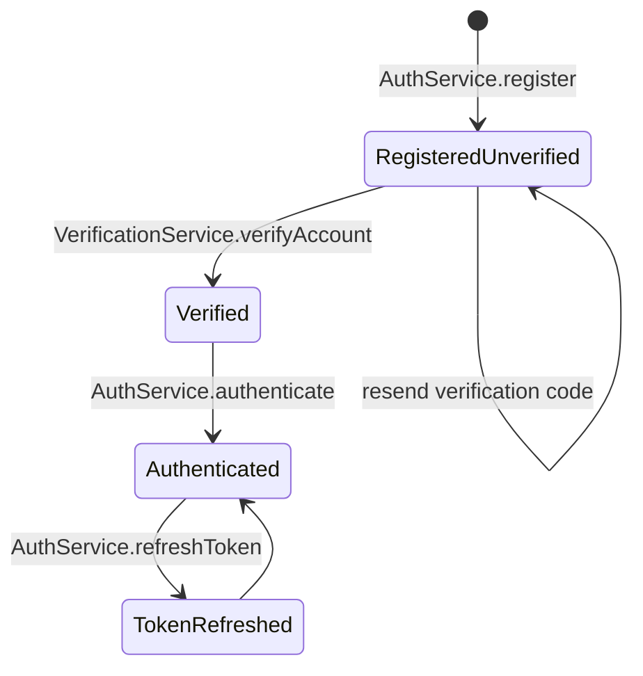
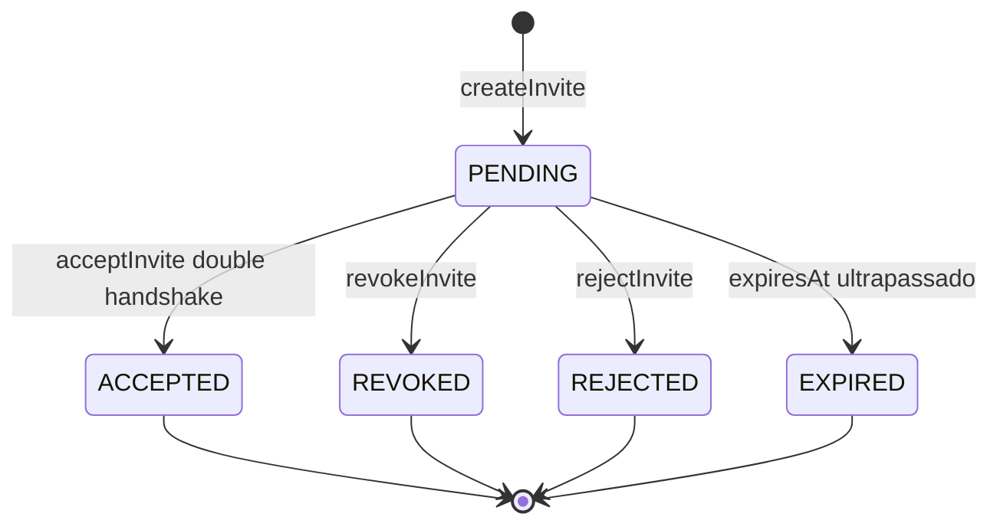
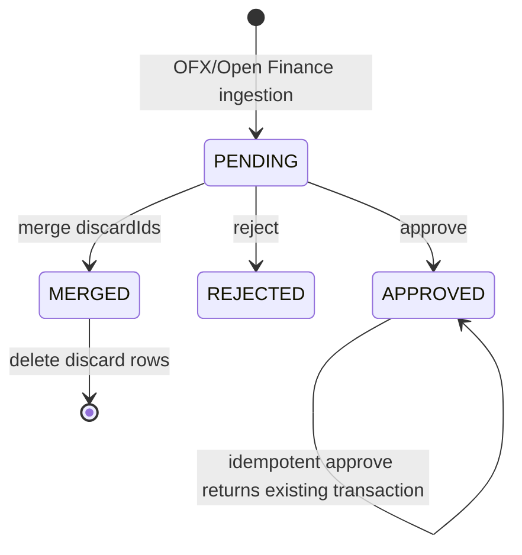
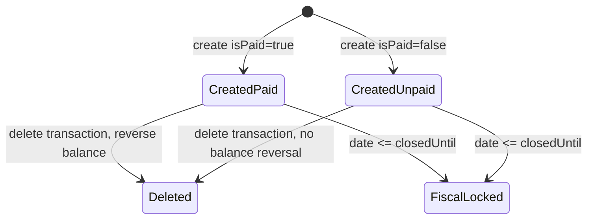
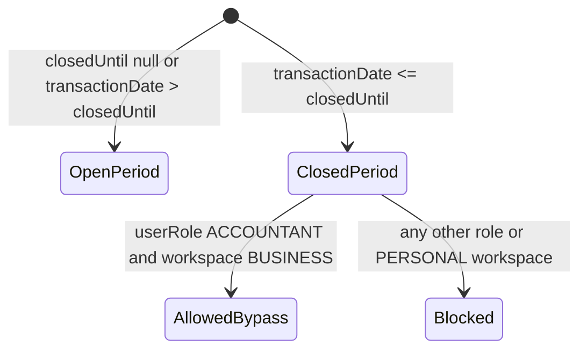
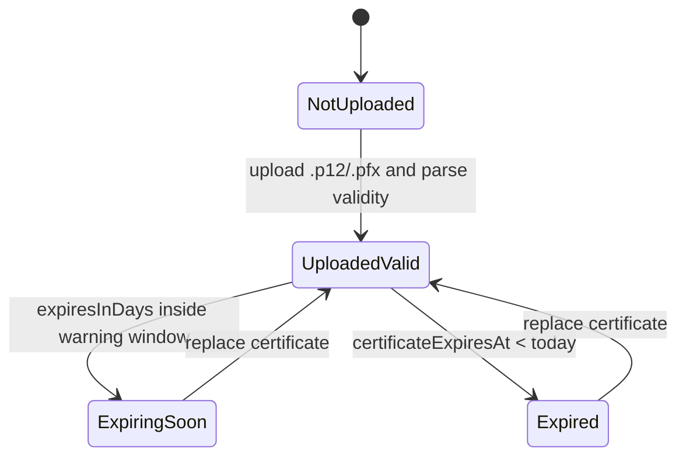

# State Machines - WSP Finance

## User Verification

| Estado | Regra | Confiança |
|---|---|---|
| `RegisteredUnverified` | `emailVerifiedAt` nulo impede login. | 🟢 |
| `Verified` | `emailVerifiedAt` preenchido permite autenticação. | 🟢 |
| `Authenticated` | access token + refresh token emitidos. | 🟢 |

## WorkspaceInvite

| Transição | Gatilho | Confiança |
|---|---|---|
| `PENDING -> ACCEPTED` | token válido, status pending, não expirado e email do usuário logado igual ao convite. | 🟢 |
| `PENDING -> REVOKED` | revogação por workspace. | 🟢 |
| `PENDING -> REJECTED` | destinatário rejeita. | 🟢 |
| `PENDING -> EXPIRED` | regra por `expiresAt`; persistência explícita do status depende do service. | 🟡 |

## BankMovement

| Estado | Regra | Confiança |
|---|---|---|
| `PENDING` | staging sem impacto no saldo. | 🟢 |
| `APPROVED` | convertido em Transaction real; saldo atualizado. | 🟢 |
| `REJECTED` | descartado sem Transaction. | 🟢 |
| `MERGED` | status transitório nos descartes antes de delete físico. | 🟢 |

## Transaction Payment/Audit State

🔴 **LACUNA**: o enum `TransactionStatus` sugere `PENDING -> COMPLETED -> RECONCILED`, mas a máquina completa de reconciliação não foi comprovada no código analisado.

## Fiscal Lock

## Certificate A1

🟢 **CONFIRMADO**: validade é extraída no backend e propagada para cache/badges. A janela visual exata é implementada no frontend por helpers de certificado.
